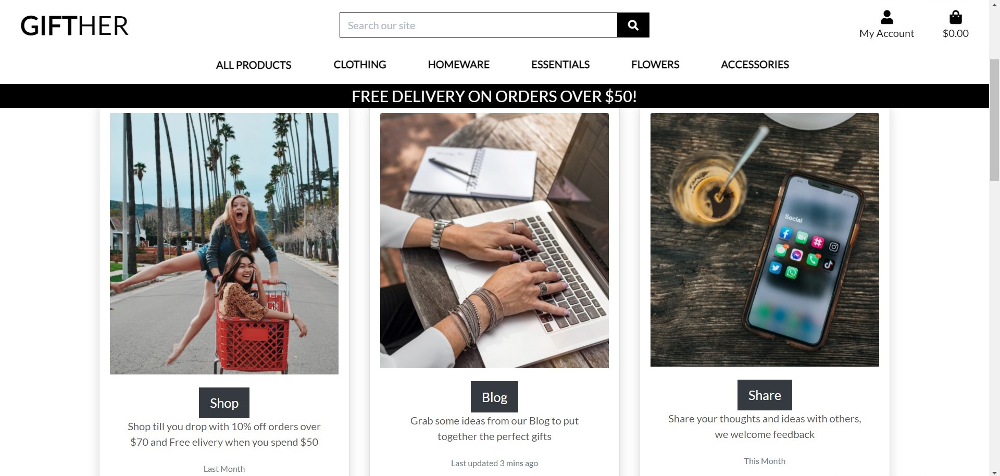
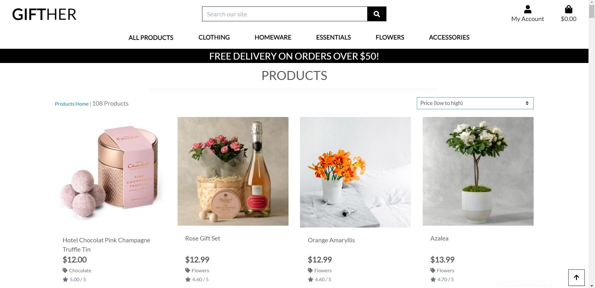
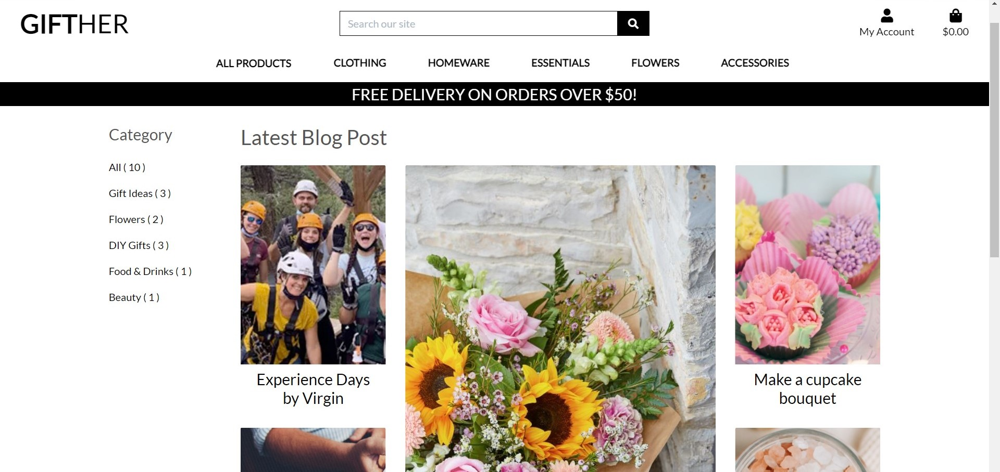
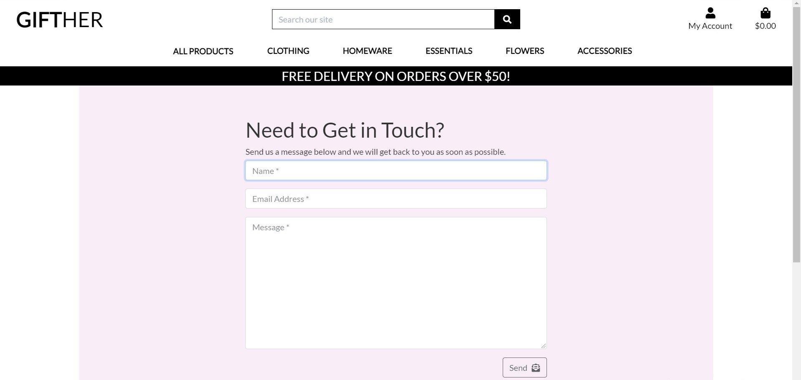
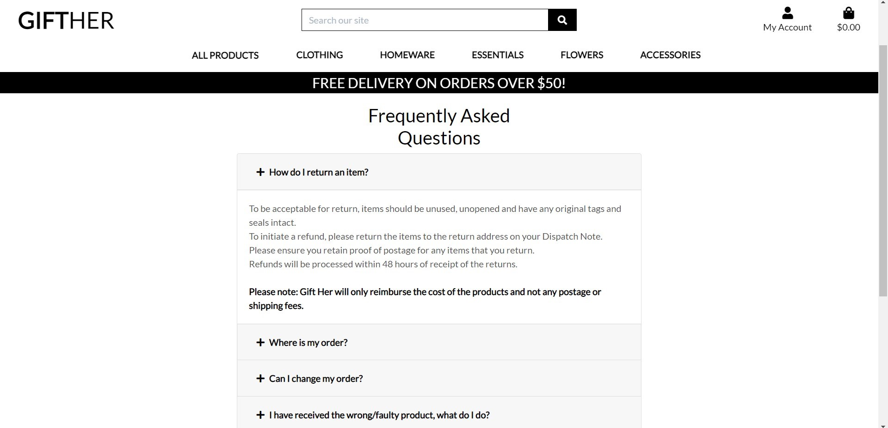

# GiftHer - First E-Commerce Project

-------------------Image goes here-----------------

## UX
### Project Goals
#### Target Audience
* People who want to buy gifts for a Girl/Woman
* Women who want to buy a treat for themselves
* People looking for a gift for a special occasion (Anniversary, Baby Shower, Party, Get well soon Gift Etc.)
* People who want to buy a variety of gifts and make their own gift hamper
* Anyone who wants to read the Discovery Blog for great gift ideas and extra articles
#### User & Visitor Goals
* Purchase products in a simple and secure way
* Have their address information stored on their profile for ease of buying
* See the product ratings before buying
* See other user comments on blog articles to see what people think who have tried and tested the article ideas
* Browse through products easily in different ways (By Price, Category, Rating)
#### Site Owners Goals
* Provide customers with a secure and safe online shop
* Be able to expand the business easily by adding new lines and products along with categories
* Establish a strong theme that continues throughout the site to keep it uniform
* Get others involved by posting article on the Blog and checking the feedback in the comments
* Make profit from selling products

## User Stories
### Site User Stories

| AS A       | I WANT TO BE ABLE TO                                                                          | SO THAT I CAN                                                                                        |
|:---------- |:--------------------------------------------------------------------------------------------- |:---------------------------------------------------------------------------------------------------- |
| Site User  | Access the website on any desktop or mobile device                                            | View and Use the website wherever I am                                                               |
| Site User  | See all the product categories from the navbar                                                | Find my way around the site easily and go to the products I want                                     |
| Site User  | Show how many items are in my shopping bag in the navbar                                      | Check the products are adding to my bag as I shop and checkout when I want                           |
| Site User  | Register for an account                                                                       | Be able to edit my information in my account profile                                                 |
| Site User  | View my order history                                                                         | Purchase the same product again easily if I like it                                                  |
| Site User  | Recover my password in case I forget it                                                       | Regain access to my account                                                                          |
| Site User  | Receive an email confirmation after registering & orders                                      | Verify that my account registration  & order was successful                                          |
| Site User  | Add comments to the blog posts                                                                | Add my own comments on a blog post or article                                                        |
| Site User  | View individual product pages that have prices, descriptions, what's included in the package  | Get information about the product before purchasing                                                  |
| Site User  | Search for a product with keywords                                                            | Find the products closest to what I'm looking for                                                    |
| Site User  | Have the delivery information prefilled on the delivery form if logged in                     | Carry out the purchase easily                                                                        |
| Site User  | Easily select the quantity of a product after adding a product to my shopping bag             | In case I change my mind and want to but another item the same or cancel those items from my purchase|

### Site Owner Stories

| AS A          | I WANT TO BE ABLE TO                            | SO THAT I CAN  |
|:-------------|:--------------------------------------------------|:--------------------------------------|
| Site Owner     | Post an article on the discovery blog  | Give site visitors interesting ideas & information |
| Site Owner     | Let the site users log in to leave comments on the blog page  | See who is leaving comments and gain feedback from customers |
| Site Owner    | Add products and product categories easily via the admin account | Update products to sell or add new lines for purchasing |
| Site Owner     | Have defensive programming in place  | Make profiles and accounts secure with passwords and customer information |
| Site Owner    | Make sure the site has 404 and 500 pages | The user can navigate easily back to the home page of the site |

## Five planes of UX
* *Strategy* - The Business goals for this project were to get the user to register with the site to become a user. 
             Browse products for purchasing and purchase those products easily. Also, use the Discovery Blog to get great gift ideas and leave 
             their thoughts in a comment on the page of the article. 
* *Skeleton* - The user would have to be able to add, view, edit and delete the products of their choice to their shopping bag as they wish.
             They would also have to register and log in to have a user profile and make purchases. 
             The users also need to be able to search for a word that will show them all the products related to that word, 
             to be able to find products they already have in mind easily.
* *Structure* - The content needed to be logically grouped together in categories and display the most logical and expected content 
              for each page visited. The home page contains an overview of the features of the site, the navbar displays the product
              categories for easy navigation and the search bar is at the top of the page to catch the users attention as they visit the site.
* *Scope* - The online store needed to include links to social media pages as the site encourages leaving reviews and comments on the Discovery Blog. 
          Site owners with access to the admin account can add Blog posts and articles, along with images and put them in the correct category.
          Site users need to be able to enjoy using the site, the overall experience needs to be hassle free and pleasant.
* *Surface* - The finished appearance of the app is simple and clean. This ensures that a user of any age is able to navigate their way 
            through the app and to be able to understand what they are looking at. The appealing images with a grey or white background of 
            the products makes the site professional and clear. The color scheme of black and white is followed to make the site uniform 
            with flashes of light pink here and there on some pages such as contact us.
            Bootstrap v4.6 was used to create the site and displays well on desktop, tablet and mobile devices.

Wireframes
The Wireframes for this project were created with balsamiq. You can find the wireframes here.

## Features
### Existing Features
#### Landing Page
The Landing Page is designed to show what features the site has. It has a Navbar and Search bar that display on each other page of the 
site too. The three cards below the hero image gives an overview of the site with link buttons to each main page. The shop now button that overlays
the hero image takes the user to the product page where they can view all the products in all categories.
The footer at the bottom of the page has links to social media platforms and extra pages.

#### Product Page
The product filter at the right hand side of the page (On a desktop) is handy for easy searching and filtering product results.
The products display nicely in a card format to keep the page nice and clean. When the product is cliked on to view, another page is displayed
which shows a larger image of the product selected and the details of the product along with a button to add the item to the shopping bag.

#### Shopping Bag Page
The shopping bag page will display all items in the current bag that the user has added. If the user has not added any products to the Bag
a message will display telling them that they have no items in the bag and shows a button to take them back to the home page.
#### Checkout Page
The page displays all the items that are about to be ordered by the user before taking them to the secure page to enter their card details for payment
by stripe. To test the stripe payments the stripe test numbers can be used 424242424242. When the payment has gone through the page will display
a pyament was successful message.
#### Discovery Blog Page
On the left hand side the categories display with links to each category of articles on the blog. The main blog page shows the latest blog articles
with a heading and image for each one. When the article is clikced on, the blog image shows at the top and the article displays underneath.
There is a comments section at the bottom of the page to see what comments people have left with an option for a user to leave a comment if logged in.

#### Profile Page
Here the user can view their order history and also their address details that have been saved in their profile.
#### Contact Us Page
This has a simple contact form for site user to fill out and the information comes through to the site owners email.

#### FAQ Page
Here there is an accordion display. Click on the selected question and a dropdown box will appear which contains the answer.

#### About Us Page
This contains a short paragraph about the goals of the site.

## Admin Product Managment
Only authenticated superusers can access the admin page 
They can add, edit and delete products and categories. Also, they can add, edit and delete blog posts, images and categories.

## Django allauth features
* Sign Up Page - The users will fill in the form with their E-mail, User Name and Password to create an account. 
  Then when the sign up form is submitted, a verification email will be sent to the user's email address to complete the sign up process.
* Log In Page - Users will input User Name or Email, and Password to log in. If the user successfully logged in, a success message 
  will display and redirect to the landing page.
* Log out Page - Log out page is accessible from the site menu navbar as with the log in and register pages. 
  After the user successfully signs out, a success message will appear and redirect them to the landing page.
* Forgot password Page - This page can be accessed from Sign In page. Users will enter their email address which they have 
  registered with the site and an email will be sent to them.

## Features Left to Implement
I would like to add the the contact us, about and faq pages a side nav for easy navigation between these pages as is displayed on the 
Discovery Blog page.

## Defensive Design
Error views (403, 404 and 500 errors)
If a 403, 404 or 500 error occurs, a page will display informing the user of the error and show a back to home page for easy navigation back.
The templates for 403.html, 404.html and 500.html are in the root template directory.
Django Form Validation is also used to make sure the forms are filled in correctly with the right amount of characters, usernames and passwords
and will display in a red color with a pop up if not correct.

## Information Architecture
### Database
Development phase SQLight database was used for the development which is installed with Django.
Deployment phase PostgreSQL was used on deployment stage, which is provided as add-on by Heroku application.
User model is provided as a default by Django's authentication system.

### Data Modeling
The two extra data models I chose to add were for the contact us page and the discovery blog page.

## Technologies Used
### Languages
* HTML, CSS, JavaScript, Python.

### Libraries, Frameworks and Extras
* Django
* Django Crispy Forms
* Django Allauth
* Bootstrap v4.6
* JQuery
* Font Awesome
* Stripe
* Google Fonts
* Images
* Gitignore
* Balamiq

### Tools
GitHub
Gitpod workspaces
PIP
Django Debug Toolbar
AWS Web Services

### Testing
* Landing Page
| Each Button Works? | Tablet/Mobile Device Responsive? | Bugs? | Forms Work? |
|:------------- |:------------- |:----- |
|       |   |   |

* Products Page
| Each Button Works? | Tablet/Mobile Device Responsive? | Bugs? | Forms Work? |
|:------------- |:------------- |:----- |
|       |   |   |

* Contact Us Page
| Each Button Works? | Tablet/Mobile Device Responsive? | Bugs? | Forms Work? |
|:------------- |:------------- |:----- |
|       |   |   |

* About Us Page
| Each Button Works? | Tablet/Mobile Device Responsive? | Bugs? | Forms Work? |
|:------------- |:------------- |:----- |
|       |   |   |

* Discovery Blog Page
| Each Button Works? | Tablet/Mobile Device Responsive? | Bugs? | Forms Work? |
|:------------- |:------------- |:----- |
|       |   |   |

* Sign In Page
| Each Button Works? | Tablet/Mobile Device Responsive? | Bugs? | Forms Work? |
|:------------- |:------------- |:----- |
|       |   |   |

* Sign Up Page
| Each Button Works? | Tablet/Mobile Device Responsive? | Bugs? | Forms Work? |
|:------------- |:------------- |:----- |
|       |   |   |

* Sign Out Page
| Each Button Works? | Tablet/Mobile Device Responsive? | Bugs? | Forms Work? |
|:------------- |:------------- |:----- |
|       |   |   |

* Profile Page
| Each Button Works? | Tablet/Mobile Device Responsive? | Bugs? | Forms Work? |
|:------------- |:------------- |:----- |
|       |   |   |

* FAQ Page
| Each Button Works? | Tablet/Mobile Device Responsive? | Bugs? | Forms Work? |
|:------------- |:------------- |:----- |
|       |   |   |

* My Account Page
| Each Button Works? | Tablet/Mobile Device Responsive? | Bugs? | Forms Work? |
|:------------- |:------------- |:----- |
|       |   |   |

* My Orders Page
| Each Button Works? | Tablet/Mobile Device Responsive? | Bugs? | Forms Work? |
|:------------- |:------------- |:----- |
|       |   |   |

* Delivery Information Page
| Each Button Works? | Tablet/Mobile Device Responsive? | Bugs? | Forms Work? |
|:------------- |:------------- |:----- |
|       |   |   |

* Footer
| Each Button Works? | Tablet/Mobile Device Responsive? | Bugs? | Forms Work? |
|:------------- |:------------- |:----- |
|       |   |   |

### Deployment
#### Heroku Deployment with AWS
To deploy this website I will follow these steps (Some have already been taken to create the project):
1. Install the following packages to the local environment, the packages are required to deploy a Django project on Heroku.
* gnicorn: gnicorn is Python WSGI(web server gataway interface) server for UNIX.
* gninx: gninx is a free, open-source, high-performance HTTP server.
* psycopg2-binary: psycopg2-binary is PostgreSQL database adapter for the Python programming language.
* dj-database-url: dj-database-url allows you to configure your Django application.
2. Create a requirements.txt file and freeze all the modules with the command pip3 freeze > requirements.txt in the terminal.
3. Create a Procfile write web: gunicorn gift_her.wsgi:application in the file.
4. Then git add . and git commit -m and git push all the changes to the Github repositoty of this project.
5. Go to Heroku and create a new app. Set a name for this app and select the closest region (Europe) and click Create app.
6. Go to the Resources tab in Heroku, then in the Add-ons search bar look for Heroku Postgres(you can type postgres), select Hobby Dev — Free and click Submit Order Form button to add it to your project.
7. In the heroku dashboard for the application, click on Settings > Reveal Config Vars and set the values for the AWS_ACCESS_KEY_ID,
   AWS_SECRET_ACCESS_KEY, DATABASE_URL, EMAIL_HOST_PASS, EMAIL_HOST_USER, SECRET_KEY, STRIPE_PUBLIC_KEY, STRIPE_SECRET_KEY, STRIPE_WH_SECRET,
   USE_AWS.
8. Temporarily comment out the current database setting in settings.py, and add the code below instead to migrate to the database.
   DATABASES = {'default': dj_database_url.parse("<the Postrgres database URL here>")}
9. Migrate the database models to the Postgres database using the following commands in the terminal: python3 manage.py migrate
10. Load the data fixtures(name the fixtures) into the Postgres database using the following command: python3 manage.py loaddata <fixture_name>
11. Create a superuser for the Postgres database by running the following command: python3 manage.py createsuperuser
12. Replace the database setting with the code below, so that the right database is used depending on development/deployed environment.
if 'DATABASE_URL' in os.environ:
    DATABASES = {
        'default': dj_database_url.parse(os.environ.get('DATABASE_URL'))
    }
else:
    DATABASES = {
        'default': {
            'ENGINE': 'django.db.backends.sqlite3',
            'NAME': os.path.join(BASE_DIR, 'db.sqlite3'),
        }
    }
13. Disable collect static, so that Heroku won't try to collect static file with: heroku config:set DISABLE_COLLECTSTATIC=1
14. Add 'gift_her.herokuapp.com', 'localhost', '127.0.0.1' to ALLOWED_HOSTS in settings.py.
ALLOWED_HOSTS = ['gift_her.herokuapp.com', 'localhost', '127.0.0.1']
15. In Stripe, add Heroku app URL a new webhook endpoint.
16. Update the settings.py with the new Stripe environment variables and email settings.
17. Save all the changes to Heroku.

#### Deployment by Heroku
Automatic deployment by Heroku can be set up with these steps:
Deploy project in Heroku dashboard.
At Automatic deploys, choose a github repository you want to deploy.
Click Enable Automatic Deploys.

#### Local Deployment
For local deployment, the following needs to be installed and an IDE is needed. I used Gitpod.
* In the IDE, copy and paste the following command into the terminal to clone this repository. 
git clone https://github.com//LRomero2/gift_her.git
Set up environment variable in the IDE, or you can create .env file in your root directory and add .env to .gitignore file, 
and add the followings to the .env file.
import os  
os.environ["DEVELOPMENT"] = "True"    
os.environ["SECRET_KEY"] = "<The Secret Key>"
os.environ["STRIPE_PUBLIC_KEY"] = "<The Stripe Public Key>"    
os.environ["STRIPE_SECRET_KEY"] = "<The Stripe Secret Key>"    
os.environ["STRIPE_WH_SECRET"] = "<The Stripe WH Secret Key>"    
Install all the required packages with pip3 install -r requirements.txt
Migrate the models to crete a database with python3 manage.py makemigrations and python3 manage.py migrate
Load the data fixtures(Type the fixtures here) into the database using the following command: python3 manage.py loaddata <fixture_name>
Create a superuser for the Postgres database by running with python3 manage.py createsuperuser
Now it's possible to run the site using the command python3 manage.py runserver

## Credits
### Content & Code
 I really loved the Blog page from https://github.com/AsunaMasuda/FloweryDays Flowery Days project so I imitated that design and code
 in this project. 
 I used the tutorial videos from code institute to create the bulk of the project and while I could have changed the design of it more, I
 actually liked it how it was so I didn't change too much. So a lot of the CSS for allauth features in particular has been copied from the videos.
The features section on the landing page was imitated from https://github.com/irinatu17/Art-of-Tea. I liked the way the paragraphs pulled together
and I added an image in the middle to make it more full.
### Images & Media
The product images were copied from the product suppliers original websites.
The extra images for the landing page etc were taken from unsplash.
### Acknowledgements
My Mentor Dick Vlaanderen has been excellent. He has given me a lot of encouragement and advice for my projects which has really helped media
persevere when the projects have been difficult. The Code Institute Tutoring team have been amazing. They are so patient and helpful and I couldn't
have finished this project without their help.
### Disclaimer
This website is created for educational purpose only and no products can be obtained through purchasing.
